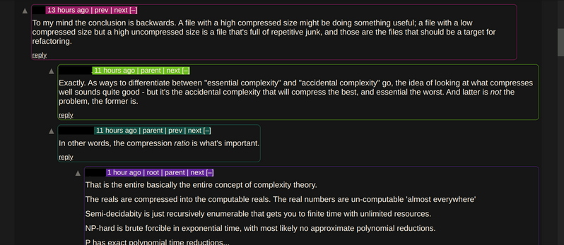

# HackerNews Color Comments

This is a Chrome / Chromium extension that colors the comments on the HackerNews
website. It makes comment sections easier to read. (At least for the developer of this extension.)

Each username has a color associated with it. (Calculated from the SHA512 hash of the username.)

This means comments by the same user will always have the same color, across all threads.

